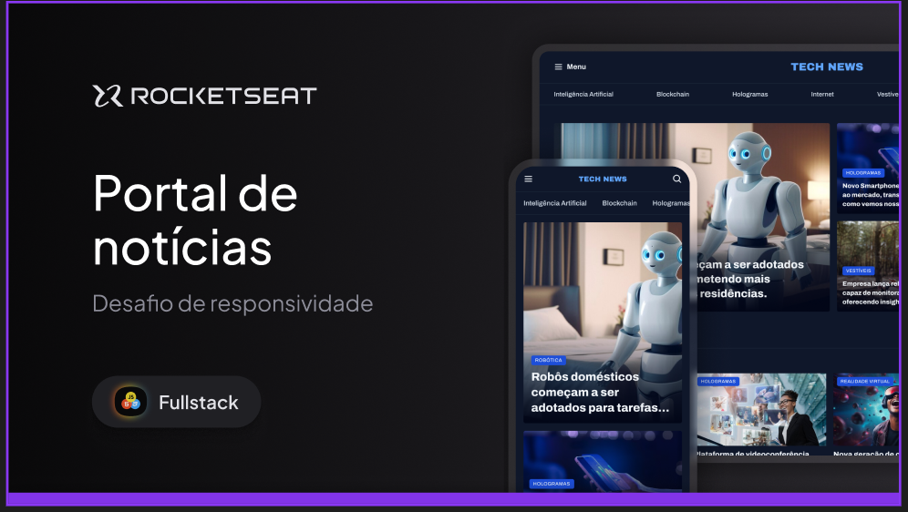

# Desafio Portal de notícias com design responsivo.

- Responsividade: é um conceito de desenvolvimento Web focado em fazer a experiência e comportamento de websites mais otimizada para todos os dispositivos, desde o desktop até um dispositivo móvel.

> Trilha FullStack - Projeto feito para cumprir desafio TECH NEWS - PORTAL DE NOTICIAS - Rocketseat :rocket:.

## :hammer_and_wrench: Tecnologias

- HTML;
- css;
- Git e Github;

## :nut_and_bolt: Neste projeto aprendi

- Semântica em HTML
- Box Model
- Display GRID
- Acessibilidade
- Tags semanticas
- Entidade que regulamenta a semantica no Brasil [W3C](https://www.w3c.br/Padroes/WebSemantica)
- Conceito da programação chamado <b>REFATORAÇÃO</b>: mudar algo interno na página sem estragar o que esta funcionando, é feito com a intenção de melhorar algo interno no código do site.

- Trabalhamos com alinhamento e espaçamento dos elementos

- Pseudo classes

- background linear-gradient
- Analizar um projeto com design feito no Figma;
- Usar fontes do Google Fonts;
- Posicionar os elementos na tela usando a propriedade
 <strong>position: absolute, relative e fixed</strong>;

## :mailbox_closed: Contatos

> Email - rosendc30@gmail.com

> Linkedin - https://www.linkedin.com/in/francisco-rosendo-a05623241/# rocketnews
